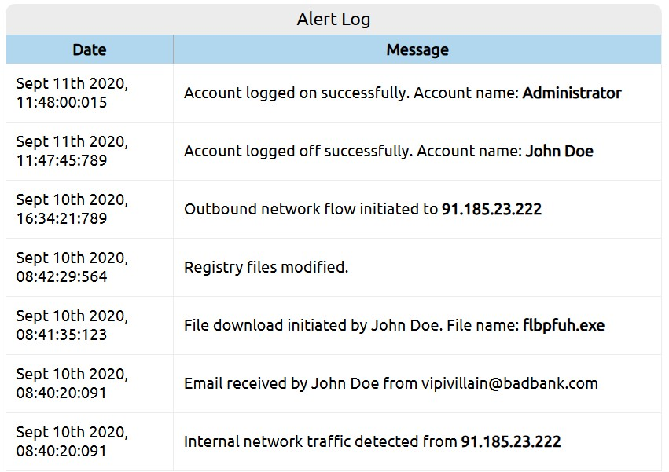
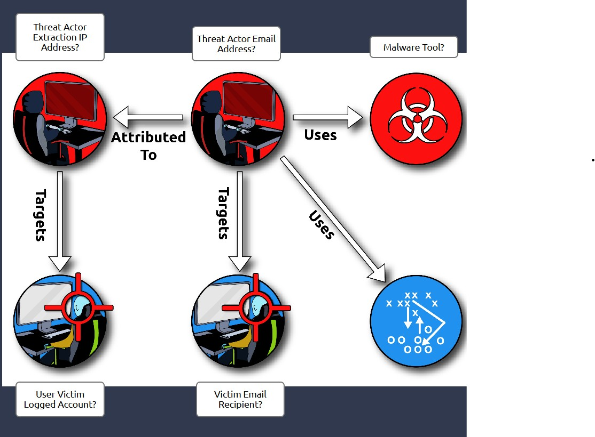
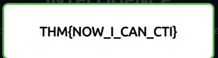

# Practical Analysis

## Overview

This task puts into practice the core ideas of Cyber Threat Intelligence (CTI).  
It walks through an incident scenario where analysts must identify indicators of compromise (IOCs), understand the adversary's behavior, and answer key investigative questions using threat intel and alert logs.

---

## Key Concepts

- **Dissemination** phase involves distributing threat reports to organizations to raise awareness of adversaries and tactics.
- Real-world CTI workflows often involve:
  - Examining logs and alert data
  - Correlating events to attacker actions
  - Identifying victims, malware, and attack paths
- Analysts rely on visual mapping to **connect adversary, tools, infrastructure, and targets**.

---

## Step-by-Step Exercise

### 1. Analyze the Alert Log  
You begin by reviewing system alerts that simulate real SIEM outputs. These include timestamps and events such as file downloads, account logins, network traffic, and email activity.

From this log, you identify important **Indicators of Compromise (IOCs)**:

- **Email source**: `vipivillain@badbank.com`
- **Malicious file**: `flbpfuh.exe`
- **Suspicious IP address**: `91.185.23.222`

---

### 2. Answer the Threat Intelligence Questions

After analyzing the log, you're asked to answer a series of CTI-related questions that simulate what an analyst might need to report internally:

Questions include:
- What was the **threat actor email address**?
- What was the **name of the malware tool**?
- What **victim's account was targeted**?

Once all questions are answered correctly, the TryHackMe platform returns a validation key:

---

## Personal Notes

- CTI becomes much clearer when applied to real data.
- I saw how **SIEM-style logs**, when structured properly, reveal patterns quickly.
- The flag-based format ensures that only by correctly interpreting the indicators and their relationships can the user retrieve the final key, encouraging attention to detail and real analytical thinking.

---

## Learned from: TryHackMe – SOC Level 1, Room "Intro to Cyber Threat Intel"
